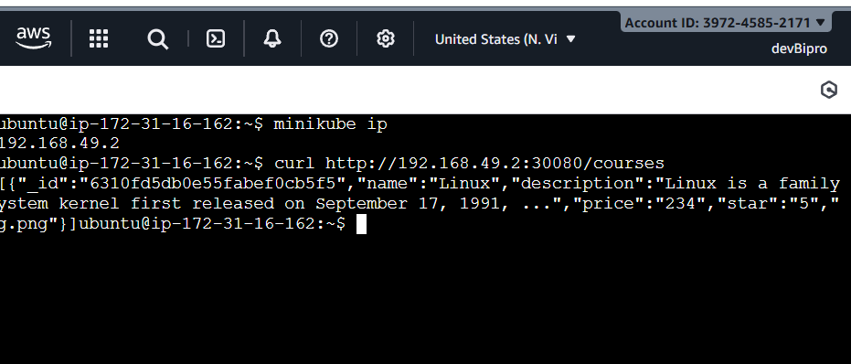

````markdown
# 🚀 Minikube Installation Guide

This guide provides **step-by-step instructions** for installing **Minikube** on Ubuntu.  
You can run a **single-node Kubernetes cluster** locally or in AWS for **development and testing** purposes.



🎥 **View Ec2 machine:** [Watch on YouTube](https://youtu.be/_esVYHajxc4)

---

## 🧩 Pre-requisites

- Ubuntu OS
- `sudo` privileges
- Virtualization support enabled  
  *(Check with the command below — output should be `1` or more)*

```bash
egrep -c '(vmx|svm)' /proc/cpuinfo
````

---

## ⚙️ Step 1: Update System Packages

Update your Ubuntu package lists to make sure you are getting the latest versions and dependencies.

```bash
sudo apt update
```

---

## ⚙️ Step 2: Install Required Packages

Install essential dependencies.

```bash
sudo apt install -y curl wget apt-transport-https
```

---

## 🐳 Step 3: Install Docker

Minikube can run a Kubernetes cluster either in a VM or locally via Docker.
This guide uses **Docker** as the driver.

```bash
sudo apt install -y docker.io
```

Start and enable Docker:

```bash
sudo systemctl enable --now docker
```

Add your user to the Docker group to avoid needing `sudo`:

```bash
sudo usermod -aG docker $USER
```

> 🔁 **Note:** You’ll need to log out and back in for this to take effect.

Alternatively (without logout):

```bash
sudo chown $USER /var/run/docker.sock
```

---

## ☸️ Step 4: Install Minikube

Download the latest Minikube binary:

```bash
curl -LO https://github.com/kubernetes/minikube/releases/latest/download/minikube-linux-amd64
```

Install Minikube:

```bash
sudo install minikube-linux-amd64 /usr/local/bin/minikube && rm minikube-linux-amd64
```

Make it executable:

```bash
sudo chmod +x /usr/local/bin/minikube
```

Check installation:

```bash
minikube version
```

---

## 🧰 Step 5: Install kubectl

Download `kubectl`, the Kubernetes command-line tool:

```bash
curl -LO "https://dl.k8s.io/release/$(curl -L -s https://dl.k8s.io/release/stable.txt)/bin/linux/amd64/kubectl"
```

Make it executable and move it into your path:

```bash
chmod +x kubectl
sudo mv kubectl /usr/local/bin/
```

Verify installation:

```bash
kubectl version --client
```

---

## 🚀 Step 6: Start Minikube

Start your Minikube cluster using Docker as the driver:

```bash
minikube start --driver=docker
```

Alternatively, if Docker is already running:

```bash
minikube start
```

This starts a **single-node Kubernetes cluster** inside Docker.

---

## ✅ Step 7: Check Cluster Status

Check Minikube cluster status:

```bash
minikube status
```

Check your Kubernetes nodes:

```bash
kubectl get nodes
```

---

## 💤 Step 8: Stop Minikube

When you’re done, stop the cluster:

```bash
minikube stop
```

---

## ❌ Optional: Delete Minikube Cluster

To completely remove your cluster:

```bash
minikube delete
```

---

# 🧱 Deploy a Sample Application

Follow these steps **after your Minikube cluster is running**.
We’ll deploy a simple app and perform a **rolling update**.

---

## 🪣 Step 1: Create a Namespace

Namespaces isolate resources within a cluster.

```bash
kubectl create namespace sample-app
```

---

## 🔐 Step 2: Create a Secret

Create a Kubernetes secret for sensitive data:

```bash
kubectl create secret generic l-tech-server-secret \
  --from-literal=db_user=bipro \
  --from-literal=db_pass=bipro \
  --from-literal=jwt_secret=erkjweklrjewkrjewkrewkjrhjwehrjwegrwegrwherg2442424243
```

---

## ⚙️ Step 3: Create a Deployment

A **deployment** defines how pods are created and managed.

Apply the deployment manifest:

```bash
kubectl apply -f 01-create-deployment.yaml
```

Review deployment details:

```bash
kubectl describe deployments.apps --namespace sample-app sample-deployment
```

---

## 🌐 Step 4: Create a Service

A **service** exposes your deployment to the network.

Apply the service manifest:

```bash
kubectl apply -f 02-service-to-expose-deployment.yaml
```

List resources in the namespace:

```bash
kubectl get all --namespace sample-app
```

---

## 🔄 Step 5: Rolling Update (New Version Deployment)

Update your app by applying a new deployment version:

```bash
kubectl apply -f 03-update-or-rollout-deployment.yaml
```

Kubernetes performs a **rolling update** to minimize downtime.

Verify the new image version:

```bash
kubectl describe deployments.apps --namespace sample-app sample-deployment
```

---

## 🌍 Step 6: Test Application Access

Get the Minikube IP:

```bash
minikube ip
```

Then test your app from the terminal:

```bash
curl http://<minikube-ip>:30080
```

If successful, you’ll see your HTML output.

---

## 🧹 Step 7: Cleanup

Remove all deployed resources:

```bash
kubectl delete namespace sample-app
```

---

🎉 **Congratulations!**
You’ve successfully installed **Minikube**, deployed a **sample Kubernetes app**, and performed a **rolling update**.


---

📺 **Live in ec2 machine:**
👉 [https://youtu.be/_esVYHajxc4](https://youtu.be/_esVYHajxc4)

```

---

